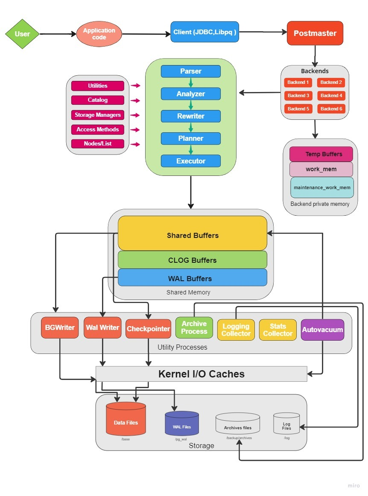
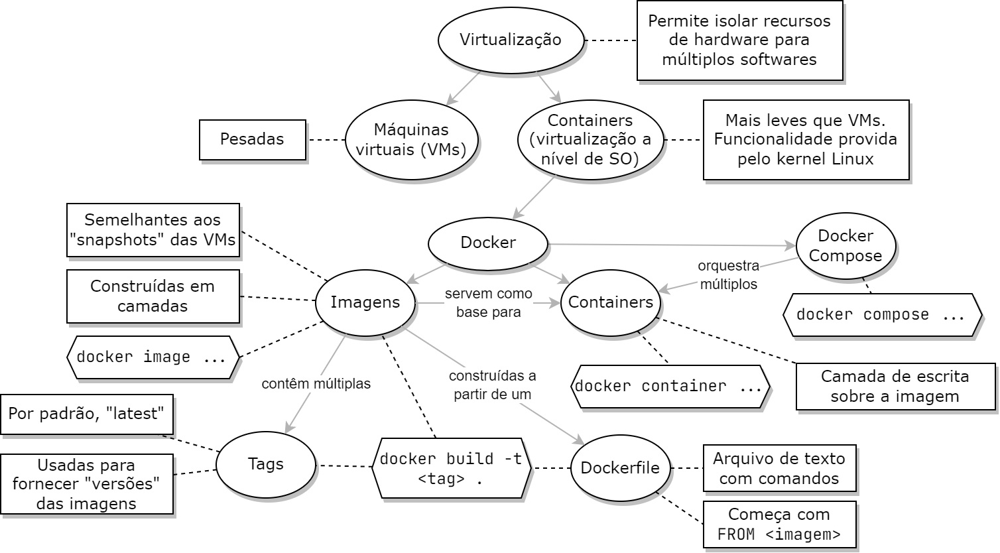

# study-path
This is a study path for many technologies.
Most of them I already study and I keep here for future references. But, some of them I still want to study

## Quick search
- [1. Databases](#1-databases)
    - [PostgreSQL](#postgresql)
    - [SQL Server](#sql-server)
    - [MongoDB](#mongodb)
- [2. Cloud Computing](#2-cloud-computing)
    - [Azure](#azure)
- [3. Programming](#3-programming)
    - [Git](#git)
    - [Docker](#docker)
    - [Python](#python)
- [4. Infrastructure as Code](#4-infrastructure-as-code)
    - [Terraform](#terraform)
    - [Ansible](#ansible)
- [5. DevOps](#5-devops)
    - [Azure DevOps](#azure-devops)
    - [Kubernetes](#kubernetes)
- [6. Monitoring And Observability](#6-monitoring-and-observability)
    - [Datadog](#datadog)
- [Usefull tools](#usefull-tools)
- [Course plataforms](#course-plataforms)

## 1. Databases
Books:
- [Database Internals](https://books.google.com.br/books?id=-l2vDwAAQBAJ&dq=database+internals&hl=&source=gbs_api)

Docs:
- [Work with relation data in Azure](https://learn.microsoft.com/en-us/training/paths/work-with-relational-data-in-azure/)

### PostgreSQL

Courses:
- [PostgreSQL Database Administration on Windows/Linux - Part 1](https://www.udemy.com/course/postgresql-v12-database-administration-on-windows-and-linux/)
- [PostgreSQL Database Administration on Windows/Linux- Part 2](https://www.udemy.com/course/postgresql-v12-database-administration-on-winlinux-part-2/)

Docs:
- [PostgreSQL Latest Documentation](https://www.postgresql.org/docs/current/index.html)
- [Explicit Locking](https://www.postgresql.org/docs/current/explicit-locking.html)
- [VACUUM](https://www.postgresql.org/docs/current/sql-vacuum.html)
- [Work with Azure Database for PostgreSQL](https://learn.microsoft.com/en-us/training/paths/microsoft-learn-azure-database-for-postgresql/)

Usefull:
- [PGConfig](https://www.pgconfig.org/#/?max_connections=100&pg_version=15&environment_name=WEB&total_ram=4&cpus=2&drive_type=SSD&arch=x86-64&os_type=linux)
- [PGTune](https://pgtune.leopard.in.ua/)
- [DBeaver](https://dbeaver.io/download/)
- [pg_repack](https://github.com/reorg/pg_repack): An alternative for VACCUM FULL. It does basically the same but ONLINE (VACUUM FULL generates LOCK).

Others:
- [17 practical psql commands that you don't want to miss](https://www.postgresqltutorial.com/postgresql-administration/psql-commands/)
- [Arquitetura de memória do PostgreSQL (Raul Diego)](https://www.youtube.com/watch?v=KMNbUERMRzc)
- [PostgreSQL para DBAs SQL Server (Parte 1)](https://www.youtube.com/watch?v=Mv2cg8CpMP8)
- [PostgreSQL para DBAs SQL Server (Parte 2)](https://www.youtube.com/watch?v=xvzVxHLlowA)
- [PGConf.Brasil](https://www.pgconf.com.br/)

Architecture:

### SQL Server

Docs:
- [SQL Server documentation](https://learn.microsoft.com/en-us/sql/sql-server/?view=sql-server-ver16)
- [Azure SQL Database documentation (PaaS)](https://learn.microsoft.com/en-us/azure/azure-sql/?view=azuresql)
- [Best practices for SQL Server on Azure VMs](https://learn.microsoft.com/en-us/azure/azure-sql/virtual-machines/windows/performance-guidelines-best-practices-checklist?view=azuresql)

Youtube channels:
- [Power Tuning](https://www.youtube.com/channel/UCvz12BbOXa7nJ-zbkQ6tI6A)
- [Fabiano Amorim](https://www.youtube.com/user/mcflyamorim/playlists)

Scripts:
- [Backup, integrity check and index/statistics maintenance](https://ola.hallengren.com/)
- [Index and statistics maintenance](https://ola.hallengren.com/sql-server-index-and-statistics-maintenance.html)

### MongoDB

Docs:
- [What is MongoDB?](https://www.mongodb.com/docs/manual/)
- [MongoDB Atlas API resources](https://www.mongodb.com/docs/atlas/reference/api-resources/)
- [Building with patterns: a summary](https://www.mongodb.com/blog/post/building-with-patterns-a-summary)

Certification path:
- [MongoDB Database Administrator (DBA) path](https://learn.mongodb.com/learning-paths/mongodb-associate-database-administrator-path)

Courses:
- [M201: MongoDB Performance](https://learn.mongodb.com/courses/m201-mongodb-performance)
- [M121: The MongoDB Aggregation Framework](https://learn.mongodb.com/courses/m121-the-mongodb-aggregation-framework)
- [M320: MongoDB Data Modeling](https://learn.mongodb.com/courses/m320-mongodb-data-modeling)

Usefull links:
- [MongoDB Atlas Portal](https://cloud.mongodb.com)
- [MongoDB Developer Community](https://www.mongodb.com/community/forums/)
- [MongoDB Support Portal](https://support.mongodb.com/)

Usefull tools:
- [MongoDB Compass](https://www.mongodb.com/products/compass)
- [Mongo Shell](https://www.mongodb.com/docs/v4.4/mongo/)
- [mtools](https://github.com/rueckstiess/mtools)

## 2. Cloud Computing

Books:
- [Cloud Computing](https://books.google.com.br/books/about/Cloud_Computing.html?hl=&id=KBwEDAAAQBAJ&redir_esc=y)

### Azure

Docs:
- [Azure REST API referece](https://learn.microsoft.com/en-us/rest/api/azure/)
- [Azure Powershell](https://learn.microsoft.com/en-us/powershell/azure/?view=azps-9.5.0)

Learning path:
- [MS Learning Path](https://learn.microsoft.com/en-us/training/)

Certification path:
- [Exam AZ-900: Microsoft Azure Fundamentals](https://learn.microsoft.com/en-us/certifications/exams/az-900/)
- [Exam DP-900: Microsoft Azure Data Fundamentals](https://learn.microsoft.com/en-us/certifications/exams/dp-900/)
- [Exam DP-300: Administering Microsoft Azure SQL Solutions](https://learn.microsoft.com/en-us/certifications/exams/dp-300)
- [Exam AZ-104: Microsoft Azure Administrator](https://learn.microsoft.com/en-us/certifications/exams/az-104/)
- [Exam AZ-305: Designing Microsoft Azure Infrastructure Soluctions](https://learn.microsoft.com/en-us/certifications/exams/az-305/)

Usefull links:
- [Azure portal](https://portal.azure.com)
- [Azure Tips and Tricks](https://microsoft.github.io/AzureTipsAndTricks/)
- [Pricing calculator](https://azure.microsoft.com/en-us/pricing/calculator/)

## 3. Programming

Books:
- [Clean Code](https://play.google.com/store/books/details?id=_i6bDeoCQzsC&source=gbs_api)

### Git
- [Official website](https://git-scm.com/)
- [Conventional Commits](https://www.conventionalcommits.org/pt-br/v1.0.0/)

### Docker
- [Free portuguese course](https://docker-unleashed.readthedocs.io/)
- [Official tutorial Docker](https://www.docker.com/101-tutorial)
- [Online Docker lab](https://labs.play-with-docker.com/)

### Python

Courses:
- [The Complete Python Bootcamp From Zero to Hero in Python](https://www.udemy.com/course/complete-python-bootcamp/?kw=The+Complete+Python+Bootcamp+From+Zero+to+Hero+in+Python&src=sac)
- [Design Pattherns in Python](https://www.udemy.com/course/design-patterns-python/)

Articles:
- [Create you custom Python package](https://towardsdatascience.com/create-your-custom-python-package-that-you-can-pip-install-from-your-git-repository-f90465867893)
- [Packing and Unpacking arguments](https://www.geeksforgeeks.org/packing-and-unpacking-arguments-in-python/)
- [Duck Typing](https://www.devmedia.com.br/duck-typing-com-python/40223)
- [Design Patterns](https://refactoring.guru/design-patterns)
- [Abstract classes in Python](https://www.geeksforgeeks.org/abstract-classes-in-python/)

Usefull links:
- [Real Python tutorials](https://realpython.com/)
- [Tech guide for Python study](https://techguide.sh/pt-BR/path/python/)
- [PEP 8 – Style Guide for Python Code](https://peps.python.org/pep-0008/#names-to-avoid)
- [Flask API](https://flask.palletsprojects.com/en/2.2.x/)
- [FastAPI VS Flask](https://www.turing.com/kb/fastapi-vs-flask-a-detailed-comparison)

Books:
- [Python Fluente](https://books.google.com.br/books?id=XqbfCgAAQBAJ&printsec=frontcover&redir_esc=y#v=onepage&q&f=false)

## 4. Infrastructure as Code

### Terraform

Docs:
- [What is Terraform?](https://developer.hashicorp.com/terraform/intro)
- [Getting started](https://developer.hashicorp.com/terraform/tutorials/cloud-get-started)
- [Terraform language documentation](https://developer.hashicorp.com/terraform/language)
- [Terraform registry](https://registry.terraform.io/)

Certification path:
- [Prepare for Terraform Certification (002)](https://developer.hashicorp.com/terraform/tutorials/certification?ajs_aid=7a14d573-1872-4d3e-81ef-7795f42f9691&product_intent=terraform)

### Ansible

Courses:
- [Ansible Basics: Automation technical overview (By RedHat)](https://rhtapps.redhat.com/promo/course/do007?segment=2)
- [Ultimate Ansible Bootcamp by School of Devops](https://www.udemy.com/course/ultimate-ansible-bootcamp/?kw=Ultimate+Ansible+Bootcamp+by+School+of+Devops%C2%AE&src=sac)
- [Ansible: Setup, configure and Ad Hoc commands deep dive](https://learn.acloud.guru/course/443e09cc-7465-438d-9d35-1bf9c1802f83/overview)

Docs:
- [Official documentation](https://docs.ansible.com/)
- [Modules index](https://docs.ansible.com/ansible/2.9/modules/modules_by_category.html)
- [Ansible Galaxy](https://galaxy.ansible.com/)

## 5. DevOps

### Azure DevOps

Courses:
- [Introduction to Azure DevOps](https://learn.acloud.guru/course/introduction-to-azure-devops/overview)

Docs:
- [Azure Pipelines](https://learn.microsoft.com/en-us/azure/devops/pipelines/?view=azure-devops)

Certification path:
- [Exam AZ-400: Designing and implementing Microsoft DevOps Soluctions](https://learn.microsoft.com/en-us/certifications/exams/az-400/)

### Kubernetes

Courses:
- [AKS Basics](https://learn.acloud.guru/course/aks-basics/overview)

Books:
- [Introducing Azure Kubernetes Service](https://books.google.com.br/books?id=GjLDDwAAQBAJ&dq=Introducing+Azure+Kubernetes+Service+:+A+Practical+Guide+to+Container+Orchestration&hl=&source=gbs_api)
- [Mastering Kubernetes](https://www.oreilly.com/library/view/mastering-kubernetes/9781839211256/)

Userfull links:
- [Kubernetes Essential Tools](https://itnext.io/kubernetes-essential-tools-2021-def12e84c572)

## 6. Monitoring And Observability

Frameworks:
- [What is OpenTelemetry?](https://docs.lightstep.com/otel/what-is-opentelemetry)

### Datadog

- [Learning path](https://learn.datadoghq.com/)
- [Support](https://help.datadoghq.com/hc/en-us)

## Usefull tools
_Diagram_:
- [excalidraw](https://excalidraw.com/)
- [draw.io](https://app.diagrams.net/)

_Password generator_:
- [LastPass](https://www.lastpass.com/pt/features/password-generator)
- [Password generator](https://passwordsgenerator.net/)

_Programming_:
- [Scratch](https://scratch.mit.edu/projects/editor/?tutorial=getStarted)
- [Comparison sorting algoritms](https://www.cs.usfca.edu/~galles/visualization/ComparisonSort.html)
- [URl encode](https://www.urlencoder.org/)
- [regexr](https://regexr.com/)
- [json to yaml](https://www.json2yaml.com/)
- [Online json editor](https://jsoneditoronline.org/#right=local.nafena)
- [Online markdown editor](https://dillinger.io/)

_Others_:
- [crontab.guru](https://crontab.guru/)
- [Dig (DNS lookup)](https://toolbox.googleapps.com/apps/dig/#ANY/)

## Course plataforms
- [Udemy](https://www.udemy.com/)
- [Cloud Guru](https://learn.acloud.guru)
- [educative.io](https://www.educative.io/)
